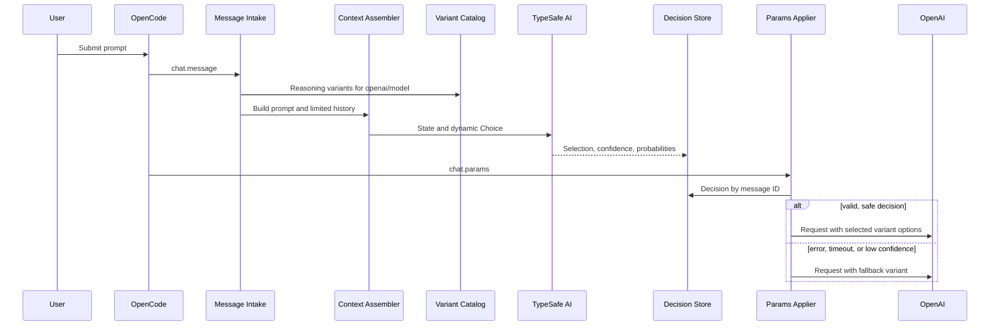

# Design: TypeSafe-driven OpenAI variant router

- Status: Superseded
- Superseded by: [TypeSafe primary-agent and variant router](../../typesafe-variant-router.md)
- Date: 2026-09-17
- Scope: Local OpenCode plugin as a precursor to a future npm package

> **Historical design snapshot - not current normative guidance.** This document preserves the rejected Choice/confidence architecture as design evidence. The active implementation uses ordered TypeSafe `Score`, `argmax(probabilities)` without a confidence threshold, the lower catalog position for exact ties, fallbacks only for technical errors or invalid responses, and best-effort synchronization of the variant shown in the OpenCode UI. All following sections describe only the former, superseded design. Current normative requirements are in the [TypeSafe primary-agent and variant router](../../typesafe-variant-router.md) operational runbook.
>
> The adjacent Archify-generated HTML/JSON snapshot intentionally remains unchanged. It is part of the historical design record, not current implementation documentation.

## Problem

OpenCode users currently select the reasoning variant of an OpenAI model manually. Before each genuine user prompt, the plugin should use TypeSafe AI to select the appropriate variant from the reasoning variants available for the current model. Only then may the OpenAI request proceed with the corresponding provider options.

## Goals

- Consider all verified reasoning variants of the current model under the `openai` provider.
- Evaluate the current prompt plus a limited amount of chat context by default.
- Make the priority between TypeSafe selection and manual selection configurable; the default is `typesafe-first`.
- Use a configured default variant on errors, timeouts, or low confidence.
- Remain locally testable and support publication as an npm plugin without an architectural change.

## Non-goals

- Support other providers or OpenAI models through OpenCode Zen.
- Automatically select variants without verified reasoning semantics.
- Rewrite or resubmit prompts, or replace OpenCode's session lifecycle.
- Treat thresholds as final without a labeled evaluation corpus.
- Define implementation tasks or code in this document.

## Constraints and quality attributes

- `TYPESAFE_API_KEY` comes exclusively from the process environment.
- The prompt path needs a hard total latency budget and a fail-open fallback.
- Selection must never produce a variant that the model does not support.
- The prompt, history, API key, and raw TypeSafe responses must not be logged.
- Multiple concurrent prompts in the same session must remain strictly isolated.
- The integration should be isolated from OpenCode SDK drift.

## Existing context

The repository already contains a prompt extraction pattern in `.opencode/plugins/oma/oma.ts::extractPromptText` and a guard for genuine user prompts in `.opencode/plugins/oma/keyword-detector.ts::isGenuineUserPrompt`. The new plugin remains decoupled from that code and adopts only the proven concepts. The installed OpenCode plugin version is `1.18.31`. Its hook contract provides `chat.message` with text parts and `chat.params` for modifying the final provider options. The newer SDK model includes `model.variants`, but the current plugin type surface may represent this field incompletely. An adapter therefore encapsulates runtime validation.

## Approaches considered

### A. Two-phase hook pipeline (selected, structural)

`chat.message` captures the prompt and context and starts the TypeSafe decision. `chat.params` consumes the correlated result and applies the variant options. This avoids duplicate submissions and starts the external evaluation early.

### B. `chat.params` only (structural)

A single hook loads the message and history, calls TypeSafe, and sets the options. State management is simpler, but history fetching and classification both remain entirely in the critical request path.

### C. Intercept and resubmit the prompt (tactical)

After classification, the prompt is resubmitted through `client.session.prompt`. This approach was rejected because of recursion, duplicate submissions, incorrect ordering, and poor plugin compatibility.

| Criterion | A | B | C |
|---|---|---|---|
| Hook contract | good fit | suitable | fragile |
| Prompt access | direct | additional fetch | direct |
| Critical latency | TypeSafe starts early | TypeSafe plus fetch | TypeSafe plus resubmission |
| State complexity | medium | low | high |
| Duplicate-submission risk | low | low | high |
| Testability | high | high | medium |
| Future viability | high | medium-high | low |

## Decision

Approach A will be implemented. A standalone plugin registers a two-phase pipeline and isolates OpenCode, TypeSafe, and policy details behind small contracts.

## Architecture

Historical generated snapshot: [001-typesafe-openai-variant-router.archify.html](./001-typesafe-openai-variant-router.archify.html)

## Components

### Plugin entry

Validates options, creates exactly one TypeSafe client, and registers hooks. Unknown configuration fields are errors. If the API key is missing, the plugin remains operational and uses the fallback.

### Message intake

Processes only genuine user messages where `providerID === "openai"`. The stable producer ID is `output.message.id`; the optional input ID is not used as a key. Text parts are joined without including files, tool output, or system parts.

The hook starts a promise whose errors are already handled internally, then returns immediately. This allows TypeSafe to work before `chat.params` needs the result.

### Context assembler

Default state:

- `currentPrompt`: current user text.
- `recentMessages`: limited, chronological user and assistant text messages.
- `model`: current OpenCode model ID.

Reasoning parts, tool output, system prompts, attachments, and metadata are excluded. `maxMessages` and `maxChars` are hard limits. `prompt-only` remains available as a data-minimizing option.

### OpenCode variant adapter

The adapter is the anti-corruption layer for the OpenCode SDK surface:

1. Defensively validate the runtime field `model.variants` as a map when present.
2. Include explicitly configured model variants as a controlled fallback.
3. Remove `disabled` variants.
4. Allow only variants with verified reasoning semantics.
5. After selection, merge only the validated variant options into `output.options`.

Without a verifiable catalog, TypeSafe routing does not occur; OpenCode's existing variant or the valid fallback remains in place. Variant names are never translated directly into assumed provider options.

### TypeSafe router

TypeSafe receives a dynamic `Choice` containing exactly the allowed variants. Criteria describe concrete task profiles, distinctions, and examples; bare names such as `low` or `xhigh` are insufficient. A response is accepted only if the Choice is in the current catalog and `confidence >= confidenceThreshold`.

A `Score` was rejected because custom variants do not necessarily form a purely linear scale. TypeSafe provides the semantic selection; deterministic code owns the candidate set, threshold, fallback, and execution.

### Decision store

A short-lived, per-process store uses `messageID` as its primary key. It stores a promise or result, but no prompt text. A TTL, maximum size, and cleanup upon consumption or session end constrain memory use and prevent stale decisions.

Internal result contract:

- `status`: `selected | fallback | skipped`
- `messageID`, `modelID`, `variant`, `reason`, `createdAt`
- optional `confidence` and `probabilities`

### Params applier

`chat.params` uses `input.message.id` as the consumer key. The result is applied only if the provider, model, and variant catalog still match the original decision. The hook waits no longer than an absolute total deadline. It merges only variant-related OpenAI options and does not replace options from other plugins.

## Configuration contract

| Field | Type / values | Default |
|---|---|---|
| `enabled` | boolean | `true` |
| `fallbackVariant` | string | must be configured explicitly |
| `confidenceThreshold` | number 0..1 | conservative, provisional |
| `timeoutMs` | positive integer | short total budget |
| `manualVariantPolicy` | `typesafe-first | manual-first` | `typesafe-first` |
| `context.mode` | `prompt-only | recent-messages` | `recent-messages` |
| `context.maxMessages` | positive integer | small and bounded |
| `context.maxChars` | positive integer | required |
| `variantsByModel` | model to validated variant definitions | empty |
| `variantDescriptions` | variant to TypeSafe criterion | built-in descriptions |
| `notify` | `off | fallback | always` | `fallback` |
| `logLevel` | `error | warn | info | debug` | `warn` |

`fallbackVariant` is validated per model. If it is invalid, OpenCode's existing variant remains unchanged, and the plugin logs a deduplicated warning without request content.

## Priority rule

- `typesafe-first`: A safe TypeSafe selection replaces even a manually selected variant. On fallback, the configured fallback variant is used.
- `manual-first`: An explicit manual variant ends routing before the TypeSafe call. Without a manual variant, the normal TypeSafe path applies.

## Error strategy

| Case | Behavior |
|---|---|
| No API key | No TypeSafe call; valid fallback; one-time warning |
| Timeout / network / 429 / 5xx | Fallback within the same total budget |
| 401 / 403 | Fallback; deduplicated diagnostic without credentials or response body |
| Low confidence | Fallback regardless of the top Choice |
| Model changes between hooks | Discard result; fall back for the final model |
| Duplicate hook execution | Reuse the existing promise |
| Missing or mismatched message ID | Fallback; diagnostic; no session ID correlation |
| Cancellation / missing consumer | TTL cleanup |
| No text | Leave OpenCode unchanged |
| Invalid variant catalog | No TypeSafe routing; unchanged or valid fallback |

SDK retries and the plugin timeout share an absolute total budget. Late responses must not affect a later message.

## Privacy and observability

- Documentation prominently states that the prompt and, by default, a limited history are sent to TypeSafe.
- Logs contain only the model ID, result status, variant name, confidence, latency class, and reason code.
- The prompt, history, API key, request state, raw response, and error response body are prohibited.
- `notify=fallback` reports only degraded decisions; `always` can make the selection visible during local testing.

## Test and validation strategy

### Contract and unit tests

- Configuration validation and defaults.
- Prompt and context filtering with hard limits.
- Variant adapter behavior for present, missing, disabled, and invalid variants.
- Confidence, timeout, error, and priority policy.
- Decision store behavior for concurrency, TTL, maximum size, and cleanup.
- Merge semantics that preserve unrelated `output.options`.

### OpenCode integration test

Before implementation is approved, a local test with a real OpenCode instance must prove:

1. `chat.message` runs before `chat.params`.
2. `output.message.id` and `input.message.id` match for the same turn.
3. The runtime catalog exposes the expected model variants, or the explicit configuration takes effect.
4. The merged OpenAI option takes effect in the final provider request.
5. Non-`openai` providers cause zero TypeSafe calls.

### Evaluation corpus

A labeled corpus of simple, medium, complex, ambiguous, and adversarial prompts measures:

- Agreement with human variant selection.
- Variant distribution per model.
- Fallback and low-confidence rates.
- p50/p95 added latency.
- Misclassifications with a high cost or quality impact.

Only then will the confidence threshold and criteria be finalized for publication.

## Fitness functions

- Type-check against the pinned `@opencode-ai/plugin` version.
- A contract test fails if the runtime variant catalog can no longer be validated.
- A test fails if a non-OpenAI turn calls TypeSafe.
- A test fails if logs contain prohibited state fields.
- A test fails if concurrent message IDs swap decisions.

## Risks and mitigations

- **OpenCode SDK drift:** Adapter, runtime schema guard, and pinned contract tests.
- **Misclassification:** Conservative confidence threshold, fallback, and evaluation corpus.
- **Latency:** Early promise start, absolute budget, and limited context.
- **Cost:** One TypeSafe Choice per relevant turn; metrics before publication.
- **Privacy:** Explicit documentation, reducible context, and no content in logs.
- **Plugin conflicts:** Field-by-field option merge instead of replacement.

## Blind review

Independent OpenCode, TypeSafe, security/privacy, reliability, QA, and end-user review perspectives identified three Tier 1 gaps: unsecured variant resolution, an optional input message ID, and possible duplicate serialization. The `OpenCodeVariantAdapter`, stable producer and consumer IDs, and the non-blocking producer closed these gaps. Tier 2 items covering context disclosure, confidence calibration, visibility, and custom variants were incorporated into the design or the publication gates. Prompt caching was rejected as Tier 3 for v1.

## Assumptions

- OpenCode invokes plugin hooks for a turn in the documented order; the integration test must confirm this.
- `chat.params.output.options` is the supported location for OpenAI provider options.
- The runtime model may contain variants even if older type surfaces do not represent them fully.
- The local prototype may use explicit variant configuration if built-in variants are not exposed.

## Sources

- OpenCode plugins: https://opencode.ai/docs/plugins/
- OpenCode models and variants: https://opencode.ai/docs/models/
- `@opencode-ai/plugin` 1.18.31 type contract
- TypeSafe Choice: https://docs.typesafe.ai/primitives/choice
- TypeSafe Confidence: https://docs.typesafe.ai/confidence
- TypeSafe JavaScript SDK: https://docs.typesafe.ai/sdk/javascript
- TypeSafe State: https://docs.typesafe.ai/concepts/state

## Transition to planning

The design permits task decomposition as the next step. Implementation begins only after a successful OpenCode contract spike covering hook order, message ID, and the variant catalog.
