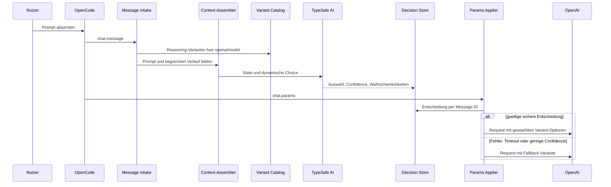

# Design: TypeSafe-gesteuerter OpenAI Variant Router

- Status: Superseded
- Superseded by: [TypeSafe Score Routing](../work/002-typesafe-score-routing.md)
- Date: 2026-09-17
- Scope: Lokales OpenCode-Plugin als Vorstufe zu einem spaeteren npm-Paket

> **Historischer Design-Snapshot — keine aktuelle normative Anleitung.** Dieses Dokument bewahrt die verworfene Choice-/Confidence-Architektur als Designbeleg. Die aktive Implementierung verwendet geordnetes TypeSafe `Score`, `argmax(probabilities)` ohne Confidence-Schwellwert, bei exaktem Gleichstand die niedrigere Katalogposition, Fallbacks nur bei technischen Fehlern oder ungueltigen Antworten sowie eine best-effort Synchronisierung der sichtbaren OpenCode-UI-Variante. Alle folgenden Abschnitte beschreiben ausschliesslich den damaligen, abgeloesten Entwurf; aktuelle normative Vorgaben stehen im [superseding Score-Routing-Plan](../work/002-typesafe-score-routing.md) und im operativen [Runbook](../../typesafe-variant-router.md).
>
> Der angrenzende, von Archify erzeugte HTML/JSON-Snapshot bleibt absichtlich unveraendert: Er ist Teil dieses historischen Entwurfsbelegs und keine aktuelle Implementierungsdokumentation.

## Problem

OpenCode-Nutzer waehlen die Denkvariante eines OpenAI-Modells heute manuell. Das Plugin soll vor jedem echten User-Prompt TypeSafe AI einsetzen, um aus den fuer das aktuelle Modell verfuegbaren Reasoning-Varianten die passende Variante zu waehlen. Erst danach darf der OpenAI-Request mit den zugehoerigen Provider-Optionen fortgesetzt werden.

## Ziele

- Alle verifizierten Reasoning-Varianten des aktuellen Modells unter dem Provider `openai` beruecksichtigen.
- Standardmaessig aktuellen Prompt plus begrenzten Chat-Kontext bewerten.
- TypeSafe-Auswahl und manuelle Auswahl konfigurierbar priorisieren; Standard ist `typesafe-first`.
- Bei Fehlern, Timeout oder niedriger Confidence eine konfigurierte Standardvariante verwenden.
- Lokal testbar bleiben und ohne Architekturwechsel als npm-Plugin veroeffentlicht werden koennen.

## Nicht-Ziele

- Andere Provider oder OpenAI-Modelle ueber OpenCode Zen unterstuetzen.
- Varianten ohne verifizierte Reasoning-Semantik automatisch auswaehlen.
- Prompts umschreiben, erneut absenden oder OpenCodes Session-Lifecycle ersetzen.
- Schwellenwerte ohne ein gelabeltes Evaluationskorpus als endgueltig behandeln.
- Implementierungsaufgaben oder Code in diesem Dokument festlegen.

## Constraints und Qualitaetsattribute

- `TYPESAFE_API_KEY` kommt ausschliesslich aus der Prozessumgebung.
- Der Prompt-Pfad braucht ein hartes Gesamt-Latenzbudget und einen fail-open Fallback.
- Die Auswahl darf niemals eine vom Modell nicht unterstuetzte Variante erzeugen.
- Prompt, Verlauf, API-Key und TypeSafe-Rohantworten duerfen nicht geloggt werden.
- Mehrere parallele Prompts derselben Session muessen strikt getrennt bleiben.
- Die Integration soll gegen OpenCode-SDK-Drift isoliert sein.

## Bestehender Kontext

Das Repository enthaelt bereits ein Prompt-Extraktionsmuster in `.opencode/plugins/oma/oma.ts::extractPromptText` und einen Guard fuer echte User-Prompts in `.opencode/plugins/oma/keyword-detector.ts::isGenuineUserPrompt`. Das neue Plugin bleibt davon entkoppelt und uebernimmt nur die bewaehrten Konzepte. Die installierte OpenCode-Plugin-Version ist `1.18.31`. Deren Hook-Vertrag bietet `chat.message` mit Text-Parts sowie `chat.params` zum Veraendern der finalen Provider-Optionen. Das neuere SDK-Modell kennt `model.variants`; die aktuelle Plugin-Typoberflaeche kann dieses Feld jedoch unvollstaendig abbilden. Deshalb kapselt ein Adapter die Laufzeitvalidierung.

## Betrachtete Ansaetze

### A. Zweiphasige Hook-Pipeline (gewaehlt, structural)

`chat.message` erfasst Prompt und Kontext und startet die TypeSafe-Entscheidung. `chat.params` konsumiert das korrelierte Ergebnis und wendet die Variant-Optionen an. Dies vermeidet Doppelversand und startet die externe Bewertung frueh.

### B. Nur `chat.params` (structural)

Ein einzelner Hook laedt Nachricht und Verlauf, ruft TypeSafe auf und setzt Optionen. Der Zustand ist einfacher, aber History-Fetch und Klassifikation liegen vollstaendig im kritischen Request-Pfad.

### C. Prompt abfangen und neu absenden (tactical)

Der Prompt wird nach der Klassifikation ueber `client.session.prompt` erneut gesendet. Dieser Ansatz wurde wegen Rekursion, Doppelversand, fehlerhafter Reihenfolge und schlechter Plugin-Kompatibilitaet verworfen.

| Kriterium | A | B | C |
|---|---|---|---|
| Hook-Vertrag | gut passend | passend | fragil |
| Promptzugriff | direkt | zusaetzlicher Fetch | direkt |
| Kritische Latenz | TypeSafe frueh gestartet | TypeSafe plus Fetch | TypeSafe plus Neuversand |
| Zustandskomplexitaet | mittel | niedrig | hoch |
| Doppelversandrisiko | niedrig | niedrig | hoch |
| Testbarkeit | hoch | hoch | mittel |
| Zukunftsfaehigkeit | hoch | mittel-hoch | niedrig |

## Entscheidung

Ansatz A wird umgesetzt. Ein eigenstaendiges Plugin registriert eine zweiphasige Pipeline und isoliert OpenCode-, TypeSafe- und Policy-Details hinter kleinen Vertraegen.

## Architektur

Historischer, generierter Snapshot: [001-typesafe-openai-variant-router.archify.html](./001-typesafe-openai-variant-router.archify.html)

## Komponenten

### Plugin Entry

Validiert Optionen, erstellt genau einen TypeSafe-Client und registriert Hooks. Unbekannte Konfigurationsfelder sind Fehler. Fehlt der API-Key, bleibt das Plugin betriebsfaehig und nutzt den Fallback.

### Message Intake

Verarbeitet nur echte User-Nachrichten fuer `providerID === "openai"`. Die stabile Producer-ID ist `output.message.id`; die optionale Input-ID wird nicht als Schluessel verwendet. Text-Parts werden zusammengefuehrt, ohne Dateien, Tool-Ausgaben oder Systemteile einzubeziehen.

Der Hook startet ein bereits intern fehlerbehandeltes Promise und kehrt sofort zurueck. Dadurch kann TypeSafe arbeiten, bevor `chat.params` das Ergebnis benoetigt.

### Context Assembler

Standard-State:

- `currentPrompt`: aktueller User-Text.
- `recentMessages`: begrenzte, chronologische User-/Assistant-Textnachrichten.
- `model`: aktuelle OpenCode-Modell-ID.

Reasoning-Parts, Tool-Ausgaben, Systemprompts, Anhaenge und Metadaten werden ausgeschlossen. `maxMessages` und `maxChars` sind harte Grenzen. `prompt-only` bleibt als datensparsame Option verfuegbar.

### OpenCode Variant Adapter

Der Adapter ist die Anti-Corruption-Layer zur OpenCode-SDK-Oberflaeche:

1. Laufzeitfeld `model.variants` defensiv als Map validieren, wenn vorhanden.
2. Explizit konfigurierte Modellvarianten als kontrollierten Fallback einbeziehen.
3. `disabled`-Varianten entfernen.
4. Nur Varianten mit verifizierter Reasoning-Semantik zulassen.
5. Nach der Auswahl ausschliesslich die validierten Variant-Optionen in `output.options` mergen.

Ohne verifizierbaren Katalog findet kein TypeSafe-Routing statt; OpenCodes bestehende Variante oder der gueltige Fallback bleibt erhalten. Variantennamen werden niemals direkt in vermutete Provider-Optionen uebersetzt.

### TypeSafe Router

TypeSafe erhaelt eine dynamische `Choice` ueber genau die zugelassenen Varianten. Kriterien beschreiben konkrete Aufgabenprofile, Abgrenzungen und Beispiele; reine Namen wie `low` oder `xhigh` reichen nicht. Die Antwort wird nur akzeptiert, wenn Choice im aktuellen Katalog liegt und `confidence >= confidenceThreshold` gilt.

Ein `Score` wurde verworfen, weil benutzerdefinierte Varianten nicht zwingend eine reine lineare Skala bilden. TypeSafe liefert die semantische Auswahl; deterministic code besitzt Kandidatenmenge, Schwellenwert, Fallback und Ausfuehrung.

### Decision Store

Kurzlebiger, pro Prozess gefuehrter Store mit `messageID` als Primaerschluessel. Er speichert Promise oder Ergebnis, aber keinen Prompttext. TTL, Maximalgroesse und Cleanup bei Verbrauch beziehungsweise Session-Ende begrenzen Speicher und verhindern veraltete Entscheidungen.

Interner Ergebnisvertrag:

- `status`: `selected | fallback | skipped`
- `messageID`, `modelID`, `variant`, `reason`, `createdAt`
- optional `confidence` und `probabilities`

### Params Applier

`chat.params` verwendet `input.message.id` als Consumer-Key. Das Ergebnis wird nur angewandt, wenn Provider, Modell und Variantenkatalog noch zur urspruenglichen Entscheidung passen. Der Hook wartet hoechstens bis zu einem absoluten Gesamt-Deadline. Er mergt nur die Variant-relevanten OpenAI-Optionen und ersetzt keine fremden Plugin-Optionen.

## Konfigurationsvertrag

| Feld | Typ / Werte | Default |
|---|---|---|
| `enabled` | boolean | `true` |
| `fallbackVariant` | string | explizit zu konfigurieren |
| `confidenceThreshold` | number 0..1 | konservativ, vorlaeufig |
| `timeoutMs` | positive integer | kurzes Gesamtbudget |
| `manualVariantPolicy` | `typesafe-first | manual-first` | `typesafe-first` |
| `context.mode` | `prompt-only | recent-messages` | `recent-messages` |
| `context.maxMessages` | positive integer | klein und begrenzt |
| `context.maxChars` | positive integer | erforderlich |
| `variantsByModel` | Modell zu validierten Variantendefinitionen | leer |
| `variantDescriptions` | Variante zu TypeSafe-Kriterium | eingebaute Beschreibungen |
| `notify` | `off | fallback | always` | `fallback` |
| `logLevel` | `error | warn | info | debug` | `warn` |

`fallbackVariant` wird pro Modell validiert. Ist sie ungueltig, bleibt OpenCodes vorhandene Variante unveraendert und das Plugin protokolliert eine deduplizierte Warnung ohne Request-Inhalte.

## Prioritaetsregel

- `typesafe-first`: Eine sichere TypeSafe-Auswahl ersetzt auch eine manuelle Variante. Bei Fallback wird die konfigurierte Fallback-Variante verwendet.
- `manual-first`: Eine explizite manuelle Variante beendet das Routing vor dem TypeSafe-Aufruf. Ohne manuelle Variante gilt der normale TypeSafe-Pfad.

## Fehlerstrategie

| Fall | Verhalten |
|---|---|
| Kein API-Key | Kein TypeSafe-Aufruf; gueltiger Fallback; einmalige Warnung |
| Timeout / Netzwerk / 429 / 5xx | Fallback innerhalb desselben Gesamtbudgets |
| 401 / 403 | Fallback; deduplizierte Diagnose ohne Credential oder Response-Body |
| Niedrige Confidence | Fallback unabhaengig vom Top-Choice |
| Modellwechsel zwischen Hooks | Ergebnis verwerfen; fuer finales Modell fallbacken |
| Doppelte Hook-Ausfuehrung | Bestehendes Promise wiederverwenden |
| Fehlende oder abweichende Message-ID | Fallback; Diagnose; keine Session-ID-Korrelation |
| Abbruch / fehlender Consumer | TTL-Cleanup |
| Kein Text | OpenCode unveraendert lassen |
| Ungueltiger Variant-Katalog | Kein TypeSafe-Routing; unveraendert oder gueltiger Fallback |

SDK-Retries und Plugin-Timeout teilen ein absolutes Gesamtbudget. Verspaetete Antworten duerfen keine spaetere Nachricht beeinflussen.

## Datenschutz und Observability

- Dokumentation weist prominent darauf hin, dass Prompt und standardmaessig begrenzter Verlauf an TypeSafe gesendet werden.
- Logs enthalten nur Modell-ID, Ergebnisstatus, Variantennamen, Confidence, Latenzklasse und Grundcode.
- Prompt, Verlauf, API-Key, Request-State, Rohantwort und Fehler-Response-Body sind verboten.
- `notify=fallback` informiert nur ueber degradierte Entscheidungen; `always` kann fuer den lokalen Test die Auswahl sichtbar machen.

## Test- und Validierungsstrategie

### Vertrags- und Unit-Tests

- Konfigurationsvalidierung und Defaults.
- Prompt- und Kontextfilterung mit harten Grenzen.
- Variant-Adapter fuer vorhandene, fehlende, deaktivierte und ungueltige Varianten.
- Confidence-, Timeout-, Fehler- und Prioritaetspolicy.
- Decision-Store fuer Parallelitaet, TTL, Maximalgroesse und Cleanup.
- Merge-Semantik, die fremde `output.options` erhaelt.

### OpenCode-Integrationstest

Ein lokaler Test mit echtem OpenCode muss vor Implementierungsfreigabe beweisen:

1. `chat.message` laeuft vor `chat.params`.
2. `output.message.id` und `input.message.id` stimmen fuer denselben Turn ueberein.
3. Der Laufzeitkatalog exponiert die erwarteten Modellvarianten oder die explizite Konfiguration greift.
4. Die gemergte OpenAI-Option ist im finalen Provider-Request wirksam.
5. Nicht-`openai`-Provider erzeugen null TypeSafe-Aufrufe.

### Evaluationskorpus

Ein gelabeltes Korpus aus einfachen, mittleren, komplexen, mehrdeutigen und adversarial Prompts misst:

- Uebereinstimmung mit menschlicher Variantenauswahl.
- Variantenverteilung pro Modell.
- Fallback- und Low-Confidence-Quote.
- p50/p95-Zusatzlatenz.
- Fehlklassifikationen mit hohem Kosten- oder Qualitaetseffekt.

Erst danach werden Confidence-Schwelle und Kriterien fuer eine Veroeffentlichung festgeschrieben.

## Fitness Functions

- Typcheck gegen die gepinnte `@opencode-ai/plugin`-Version.
- Vertragstest scheitert, wenn der Runtime-Variant-Katalog nicht mehr validierbar ist.
- Test scheitert, wenn ein Nicht-OpenAI-Turn TypeSafe aufruft.
- Test scheitert, wenn Logs verbotene State-Felder enthalten.
- Test scheitert, wenn parallele Message-IDs Entscheidungen vertauschen.

## Risiken und Gegenmassnahmen

- **OpenCode-SDK-Drift:** Adapter, Runtime-Schema-Guard und gepinnte Vertragstests.
- **Fehlklassifikation:** konservative Confidence-Grenze, Fallback und Evaluationskorpus.
- **Latenz:** frueher Promise-Start, absolutes Budget, begrenzter Kontext.
- **Kosten:** eine TypeSafe-Choice pro relevantem Turn; Metriken vor Veroeffentlichung.
- **Datenschutz:** explizite Dokumentation, minimierbarer Kontext und logfreie Inhalte.
- **Plugin-Konflikte:** feldweises Options-Merge statt Ersetzung.

## Blind Review

Unabhaengige Linsen fuer OpenCode, TypeSafe, Security/Privacy, Reliability, QA und Endnutzer fanden drei Tier-1-Luecken: ungesicherte Variantenaufloesung, optionale Input-Message-ID und moegliche doppelte Serialisierung. Sie wurden durch den `OpenCodeVariantAdapter`, stabile Producer-/Consumer-IDs und den nicht blockierenden Producer geschlossen. Tier-2-Punkte zu Kontextfreigabe, Confidence-Kalibrierung, Sichtbarkeit und Custom-Varianten sind in das Design beziehungsweise die Veroeffentlichungsgates aufgenommen. Prompt-Caching wurde als Tier 3 fuer v1 verworfen.

## Annahmen

- OpenCode ruft Plugin-Hooks fuer einen Turn in der dokumentierten Reihenfolge auf; der Integrationstest muss dies bestaetigen.
- `chat.params.output.options` ist der unterstuetzte Ort fuer OpenAI-Provider-Optionen.
- Das Laufzeitmodell kann Varianten enthalten, obwohl aeltere Typoberflaechen dies nicht vollstaendig ausdruecken.
- Der lokale Prototyp darf eine explizite Variantenkonfiguration nutzen, falls eingebaute Varianten nicht exponiert werden.

## Quellen

- OpenCode Plugins: https://opencode.ai/docs/plugins/
- OpenCode Models und Varianten: https://opencode.ai/docs/models/
- `@opencode-ai/plugin` 1.18.31 Typvertrag
- TypeSafe Choice: https://docs.typesafe.ai/primitives/choice
- TypeSafe Confidence: https://docs.typesafe.ai/confidence
- TypeSafe JavaScript SDK: https://docs.typesafe.ai/sdk/javascript
- TypeSafe State: https://docs.typesafe.ai/concepts/state

## Uebergang zur Planung

Das Design erlaubt als naechsten Schritt eine Aufgabenzerlegung. Implementierung beginnt erst nach einem erfolgreichen OpenCode-Vertrags-Spike fuer Hook-Reihenfolge, Message-ID und Variantenkatalog.
